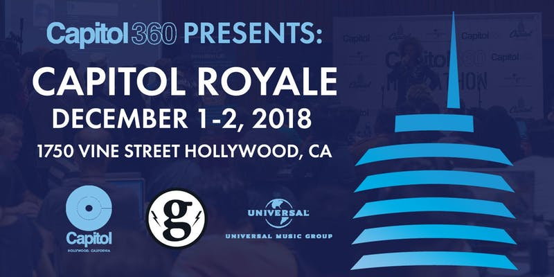

# Capitol Royale 2019 Hackathon Guide

**When**: November 15th-17th, 2019   
**Where**: Capitol Records – 1750 Vine St, Los Angeles, CA 90028 + Kimpton Everly Hotel

Designed to foster innovative ideas and bridge the gap between content creators and the tech community, this 2- day Hackathon will bring together software developers, and acclaimed producers, songwriters, and influencers in a challenge to incubate new waves of music-related products, services, and content.

The theme this year is: Music on the Move, and will focus on in-car entertainment and immersive music experiences.

All participants will have access to the state-of-the-art Capitol Recording Studios and a catalog of UMG audio streaming tracks.


**Check back on this page for access to never before seen footage and archival content!!**


## Steps to Success

* [ ] Like Capitol360's [Facebook Page](https://www.facebook.com/CapitolMusic360/) and join the [Capitol360 Hackers Group](https://www.facebook.com/groups/527780350991187/)
* [ ] Get a [Cloudinary](https://cloudinary.com/signup?utm_source=CMW&utm_medium=Gitbook&utm_campaign=Evangelism&utm_term=Hackathon-Guide&utm_content=Signup_CMW) Account and Credentials
* [ ] Visit Cloudinary + UMG Table at the Event to get add-on UPGRADE: [http://bit.ly/cmw-upgrade](http://bit.ly/cmw-upgrade)​ and additional API Keys
* [ ] Register yourself for the Capitol360 Hackathon on [Devpost](https://capitol-hackathon-nov-2019.devpost.com/?preview_token=FbsaO4IxKNtwfPp3bjsgIPEpQwVYrOCeEchsMGphuRI%3D) **All submissions must be posted on Devpost by 1:00pm on November 17th** 

The Capitol360 Innovation Center Hackathon brings together coders, developers, hackers, artists, designers and tech specialists for 24 hours of intense work, debates, brainstorming, innovation, camaraderie and fun! Each team is invited to formulate solutions to problems and create new pathways to move the music industry forward.

We're hackers too, so we know your time at the Hackathon is limited. That's why we've developed this guide to help you harness our technology to realize your ideas in the most efficient way possible.

## Sandbox License

Developers will have pre-cleared access to 40k UMG audio streaming tracks. Winners are eligible for an 8-month Innovation License for continued access to our sandbox. 

Artists included in this catalog include old and new, and cross genre: **Frank Sinatra, Michael Jackson, Elton John, Diana Ross, Neil Diamond,Imagine Dragons, Halsey, Rihanna, Maroon 5,Hans Zimmer, Andrea Bocelli, John Williams**

**Blue Note:** We will be opening up select assets from our digitized archives to developers, in a challenge to build an immersive catalog experience: 

* Tape transfers + tape box scans
* Production Masters
* Mix Reels including out-takes
* Photo session scans
* Music Videos/Session Videos
* Art flat scans + illustrations


This Hackathon Guide is a living document which we update frequently with additional info and code examples. It's meant to be a quick start in learning about Cloudinary and how to integrate other APIs featured at this event. Please take a few moments to check out and follow the guide's thought starters links. ****And, don't forget to check back here often for new content. **A wrapper, integrating most available APIs, will be available soon**, brought to you by Glitch. **Feel free to use, modify and extend our blueprint apps for your Hack.**  


