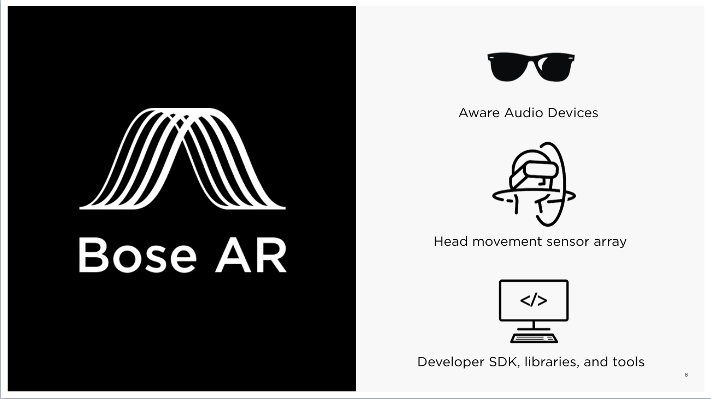

# Bose AR Platform and SDKs

Bose AR is connected-device _**audio**_ augmented reality platform. Bose AR-enabled devices are equipped with a sensor package to enable astonishing experiences.

The inertial motion unit \(IMU\) contains an accelerometer, gyroscope, magnetometer, and a microphone. These sensors allows the developer to receive more information about the user with respect to head tracking, head orientation, and position in the real world. With the Bose AR iOS SDK and Bose hardware that is AR-enabled \(equipped with the sensor package\), you can build applications that are audio-first, heads up and hands-free.

Our goal is to enable developers using the iOS SDK and Bose AR-enabled hardware to create astonishing real-world experiences and fundamentally new ways to travel, exercise, learn, play, and more. Go through life heads-up, hands-free, and ears amazed.

The goal of this particular guide is to have fun! Subsequent tutorials will go more in-depth about what the different components of the SDK are and how to integrate it to your application.

