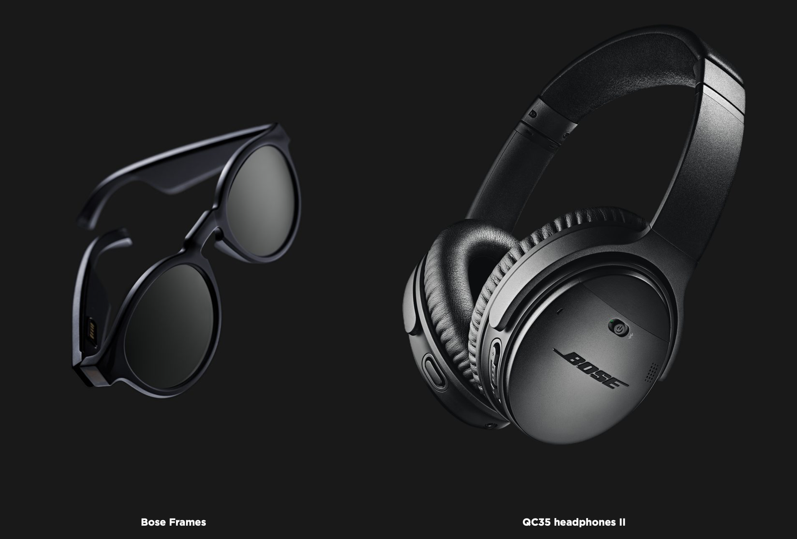

# Build for Bose AR Enabled Wearables



Our Bose AR developer and creator tools pair with millions of Bose AR-enabled products that have motion sensors embedded inside to work together with your mobile device. Using information like your location, your head gestures, and the direction you’re looking, Bose AR-enhanced apps create audio experiences in the world around you — while you keep your phone in your pocket.

The first available Bose AR enabled wearables are Bose Frames and QC35 II Headphones. Bose Frames, our first ever audio sunglasses, launched in December of 2018. The debut collection features two classic silhouettes with built-in Bose speakers for an immersive audio experience unlike any other. Our QC35 II Headphones feature industry-leading noise-canceling technology. AR-enabled versions of these began shipping also in December 2018 and will pair with Bose AR experiences via a firmware update from our Bose Connect app.

Learn more about Bose AR, our AR-enabled wearables, and see where we promote our most compelling applications at [**bose.com/ar**](https://www.bose.com/en_us/better_with_bose/augmented_reality.html)**.**

