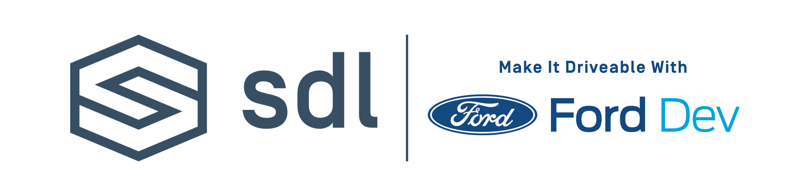

# Music That Moves YOU Challenge, Presented by SDL & FordDev

_**Music That Moves YOU Challenge, Presented by**_ [_**SDL**_](https://smartdevicelink.com) _**&**_ [_**FordDev**_](https://developer.ford.com/)_\*\*\*\*_

How can today’s technology evolve the music experience in the car from discovering new artists and music, to purchasing concert tickets and merchandise, to immersive lifestyle experiences that deliver just-in-time content, personalized offers, and can connect fans with all aspects of their favorite artists? 

The _**Music That Moves YOU**_ challenge wants to see how our innovative developer community can take advantage of the unique opportunities’ cars offer. Not just delivering music to listeners in the car...but the actual ability to bring fans to _the music!_  

_**Music That Moves YOU**_ challenges participants to envision how radio listening, concert experiences, curated special events, and pop up merch stores can be created enhanced, and delivered through the use of APIs from cutting edge companies including Ticketmaster, iHeartMedia and Arrive. These top brands will provide participants unprecedented access to their APIs and the project which weaves the most innovative experience together with Connected Travel and [SDL APIs](https://smartdevicelink.com/docs/) will win the grand prize of $12,000!

**Music that Moves YOU Challenge Partners:**

* Vehicle APIs: SDL
* Voice commerce: Connected Travel
* Parking: Arrive
* Radio: iHeartMedia
* Ticketing: Ticketmaster
* Merchandise: Shopify

Challenge participants will:

●     Have the chance to win a grand prize of $12,000 cash PLUS support for integrating winning app.

●     Get unprecedented access to the top technology teams from automakers such as Ford and other SDL adopters.

●     Gain hands-on experience with in-vehicle hardware already in use around the world, and exciting soon-to-launch connected products.

●     Dive in to vehicle generated data such as Fuel Level, GPS Location, or Number of Occupants and show off some new and exciting features you can deliver to drivers and passengers.

●     Present your project in front of auto industry decision makers.

●     Collaborate and innovate with top connected car developers from around the world.

\*\*\*\*

**PRIZES**

● Grand Prize: $12,000 PLUS 20-hours of remote support for continued integration of the winning app.

● 2nd Place: $2,000 PLUS up to 5 Pairs of Tickets to a show of the winner’s choosing at the iHeartRadio Theater in LA. Recent performers include Elton John, Bastille, the Chainsmokers, Trisha Yearwood, Lizzo and Tyga.

● 3rd Place: $1,000 PLUS 5 iPad Air 2’s and 5 Amazon Echo Dot’s

\*\*\*\*

**DOCUMENTATION**

●  All of the official SDL documentation can be viewed [here](https://smartdevicelink.com/docs/), including:

      ○     Account Creation

      ○     AppID Generation

      ○     Development Guides

      ○     Emulator

      ○     HMI Templates

●  **Ticketmaster:** [**https://developer.ticketmaster.com/products-and-docs/apis/getting-started/**](https://developer.ticketmaster.com/products-and-docs/apis/getting-started/)

[**https://developer.ticketmaster.com/support/terms-of-use/**](https://developer.ticketmaster.com/support/terms-of-use/)

● **Arrive -** [**https://developer.arrive.com**](https://developer.arrive.com)   ****  

**ABOUT SDL & FORDEV**

[**SDL**](https://eur02.safelinks.protection.outlook.com/?url=https%3A%2F%2Fsmartdevicelink.com%2F&data=02%7C01%7CChingChing.Chen%40umusic.com%7Cd927e69dfa464dc2dbc108d743620e97%7Cbbcb6b2f8c7c4e2486e46c36fed00b78%7C1%7C0%7C637051960749037882&sdata=dnfqbq%2Fd6nRFp37bFpMpdFeF2KfGr%2B%2BoQ8LQ1%2FGZUcE%3D&reserved=0) is the industry standard for open source in-vehicle connectivity. For automakers and suppliers, SDL adoption broadens the choices for customers in how they connect and control their smartphones while on the move. SDL is the open source software on which the Ford AppLink platform is built. Industry adoption of SDL provides significant benefits to developers interested in connecting their apps for safer in-vehicle use.

The [Ford Developer Program](https://eur02.safelinks.protection.outlook.com/?url=http%3A%2F%2Fford.to%2F2uKi7OT&data=02%7C01%7CChingChing.Chen%40umusic.com%7Cd927e69dfa464dc2dbc108d743620e97%7Cbbcb6b2f8c7c4e2486e46c36fed00b78%7C1%7C0%7C637051960749047878&sdata=A3m6n%2FkRNaX5HKq81WXKgF58ujEh6Z1qo2z2GDHK2vI%3D&reserved=0) opened its doors at CES in 2013, commemorating the 150th anniversary of Henry Ford’s birth, celebrating his innovative spirit and his belief that to create something truly great, he needed to surround himself with other likeminded individuals. By creating the automotive industry’s first end-to-end developer ecosystem, Ford invited developers from all across the globe to innovate and see their content enjoyed in the vehicle in a way never seen before and over 30,000 developers have done so. At this monumental event, Ford contributed the AppLink core to the open source community…and SDL was born!

