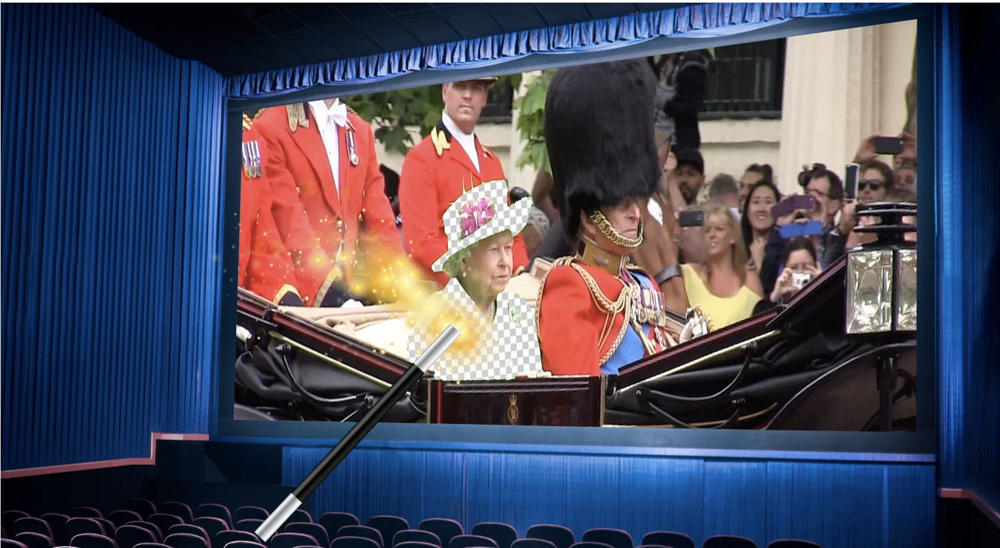
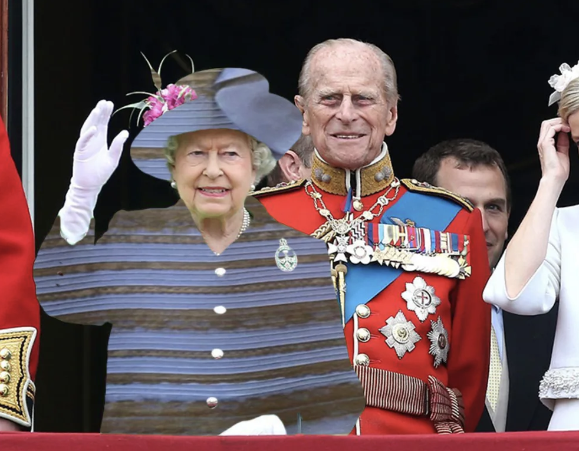
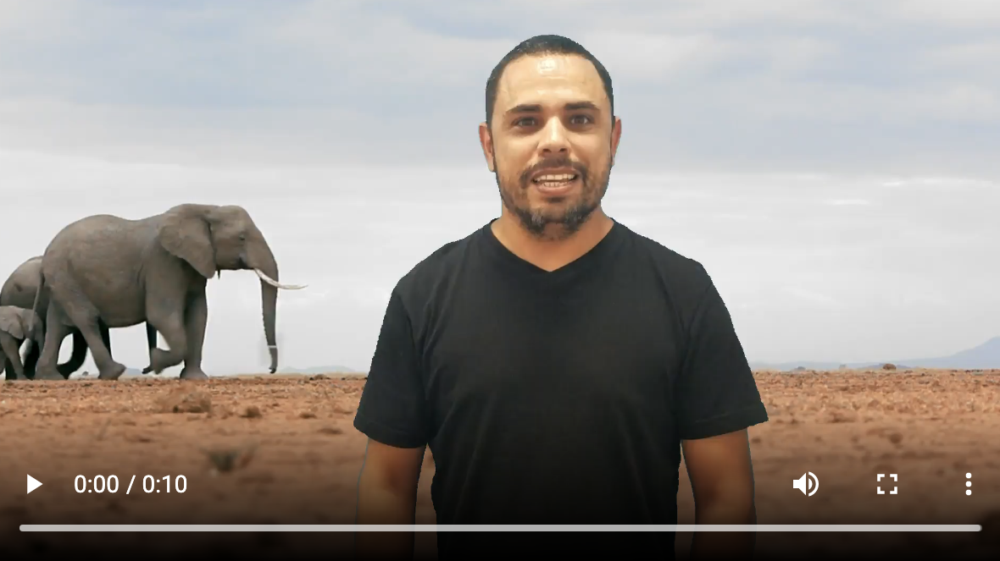
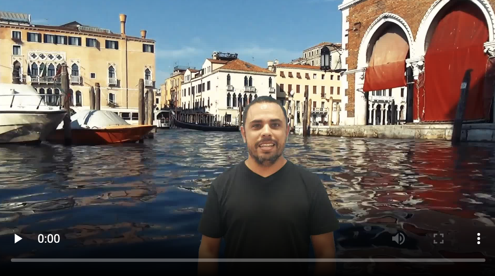

# Video Animation + Background Removal \(Green Screen Effect\)

If you were reading your social media or news feeds on or around June 11 this year, no doubt you came across your fair share of posts about Queen Elizabeth and her outfit-color faux pas. For her 90th birthday, she chose a solid neon green suit, and it didn't take long for Photoshop fanatics to suggest alternative designs for the Queen's green-screen threads.

Replacing her green suit with the [famous blue or white dress](https://en.wikipedia.org/wiki/The_dress) is just one of [many examples](https://www.boredpanda.com/queen-elizabeth-green-screen-outfit-funny-photoshop-battle/?utm_source=google&utm_medium=organic&utm_campaign=organic):

[Cloudinary](https://cloudinary.com/) is loved by developers for, among other things, its huge collections of on-the-fly programmatic image and video transformation options. Automatically generating an **image** that replaced the Queen's greens with an alternative design using Cloudinary image transformations would be no challenge.

But we wanted a challenge. So in honor of the Queen, Cloudinary now supports its `make_transparent` parameter also **for** [**video**](https://cloudinary.com/features/video_transcoding)!

Given that in video, the color you want to make transparent is usually a moving target, this involves a more sophisticated algorithm for us, but it's still just one on-the-fly transformation away for you.

For example, look what you get if you place the Queen's Coach Ride video as an overlay over a nice animated hearts video, and then apply the new dynamic video transparency parameter \(`make_transparent`\) to the Queen's green \(hex color `#87ff66`\) suit. You guessed it… **A Queen of Hearts**!



**Here's what the URL for this video looks like:** 

\*\*\*\*[**https://res.cloudinary.com/demo/video/upload/w\_800/du\_15,so\_12/l\_video:docs:green\_screen\_queen,e\_make\_transparent:15,co\_rgb:87ff66,fl\_relative,w\_1.0/docs/animated\_hearts.mp4**  
](https://res.cloudinary.com/demo/video/upload/w_800/du_15,so_12/l_video:docs:green_screen_queen,e_make_transparent:15,co_rgb:87ff66,fl_relative,w_1.0/docs/animated_hearts.mp4
)\*\*\*\*

_**\(You can see how you would generate the URL in your web or mobile app using one of our many SDKs in your favorite language here:**_ [https://cloudinary.com/blog/green\_screen\_queen\_dynamic\_video\_transparency\_fit\_for\_royalty](https://cloudinary.com/blog/green_screen_queen_dynamic_video_transparency_fit_for_royalty)_**\)**_

## Seeing through the URL

In case you haven't played with Cloudinary transformation URLs before, here's a quick walk through \(or 'see through', if you will\):

* **https://res.cloudinary.com/demo/video/upload...** The first part of the URL defines your Cloudinary account and how/where the video to deliver is stored in your account.

* **.../w\_800/du\_15,so\_12...** The next two components are transformations that scale the video down to a width of `800` pixels and shorten the overall video duration to `15` seconds.

* **.../l\_video:docs:green\_screen\_queen,...**

  
Now the fun part. The `/l_` component \( `overlay` in SDKs\) adds the **green\_screen\_queen** video \(from the `/docs` folder\) as a layer over the base **animated\_hearts** video.

* **...e\_make\_transparent:15,co\_rgb:87ff66,...** The `make_transparent` parameter is applied to the overlay video with a tolerance of `15` to allow for minor color variations, and specifies that the transparency should be applied to the hex color `87ff66` \(the particular shade of green that the Queen chose to wear\).

* **...fl\_relative,w\_1.0...** Additionally, the overlayed video is width is scaled to 1.0 \(100%\) relative to the width of the base video so that the top layer exactly covers the base video.

* **.../docs/animated\_hearts.mp4** Finally, we specify the base video: **animated\_hearts.mp4** \(also from the `/docs` folder\). In this case, the base video will actually be hiding behind the identically-sized queen video layer, and will show through only where the top video layer is transparent.

#### Seconds after you deliver this URL for the first time, your video is generated and the specified green color is transparent throughout the duration, regardless of where that color appears or moves within your video.

## It's Not Easy Being Green

"Green screen" transparency for both image and video isn't a new concept of-course, but usually it requires manually applying the transparency in video editing software. Additionally, most of these video editors can only achieve video transparency for a specific and very solid shade of green or in some cases, maybe a specific royal blue color. But that specific green \(or blue\) requirement can be limiting.

In contrast, Cloudinary's **make\_transparent** feature, isn't picky at all. Specify any hex color, along with an optional tolerance level, and go. For example, all we have to do is change the color code accompanying the `make_transparent` parameter to a light-red shade \(`#ff4d4b`\) in the URL we used above, and now it's the footmens' previously light-red uniforms who are getting the love:



## It's time to get serious

No doubt that redesigning clothes using video transparency can be entertaining, but there are more practical uses for the `make_transparent` video transformation.

For example, what if you want to deliver a video tutorial or product demo with a talking head? No special green-screen studio is necessary. Just find any solid colored wall or hang a sheet in a color that's not too similar to the speaker's face color or clothing, and then use `make_transparent` to remove the video background.

Here's a video we created in our turquoise-painted meeting room:



               [https://res.cloudinary.com/demo/video/upload/docs/talking\_head\_travel.mp4](https://res.cloudinary.com/demo/video/upload/docs/talking_head_travel.mp4)

Now we just overlay this talking\_head video on top of the video he's supposed to be talking about, set the transparency color to match the paint color, and we can send our narrator anywhere we want. How about a quick trip to Africa?

[https://res.cloudinary.com/demo/video/upload/so\_8/l\_video:docs:talking\_head\_travel,e\_make\_transparent:18,co\_rgb:5ec2c4,w\_1.0,fl\_relative/du\_10/elephants.mp4](https://res.cloudinary.com/demo/video/upload/so_8/l_video:docs:talking_head_travel,e_make_transparent:18,co_rgb:5ec2c4,w_1.0,fl_relative/du_10/elephants.mp4)

We can also choose what size we'd like our overlay speaker to be, either relative to the base \(background\) video or as a fixed pixel size, and where we'd like to place him. Here, we didn't want to make our speaker look too big relative to the entire galaxy, so we made him a bit smaller \(40% of the base video width\), and moved the transparent video overlay to the bottom right of the base video:



[https://res.cloudinary.com/demo/video/upload/so\_8/l\_video:docs:talking\_head\_travel,e\_make\_transparent:15,co\_rgb:5ec2c4,w\_0.4,fl\_relative,g\_south\_east/du\_10/galaxy\_spin.webm](https://res.cloudinary.com/demo/video/upload/so_8/l_video:docs:talking_head_travel,e_make_transparent:15,co_rgb:5ec2c4,w_0.4,fl_relative,g_south_east/du_10/galaxy_spin.webm)

We can even take advantage of other Cloudinary video transformations. For example, in this transformation URL, we added the fade out effect to the last two seconds of the overlay video, as the narrator presumably travels to his next surprise location...

Note the use of the `layer_apply` flag so that two different effects \(`make_transparent` and `fade`\) can be applied in separate components to the same overlay:

[https://res.cloudinary.com/demo/video/upload/e\_accelerate:-50/l\_video:docs:talking\_head\_travel,e\_make\_transparent:15,co\_rgb:5ec2c4,w\_0.7,fl\_relative/e\_fade:-2000/g\_south,fl\_layer\_apply/du\_10/venice\_waters.mp4](https://res.cloudinary.com/demo/video/upload/e_accelerate:-50/l_video:docs:talking_head_travel,e_make_transparent:15,co_rgb:5ec2c4,w_0.7,fl_relative/e_fade:-2000/g_south,fl_layer_apply/du_10/venice_waters.mp4)

## Go For It! 

Cloudinary videos, see the [**video effects**](https://cloudinary.com/documentation/video_manipulation_and_delivery#video_effects) ****documentation in the _**Video Transformations Guide**_**.**

Once you've got your cool video transparency effect ready to go, you can easily embed it in your web or mobile site using the [**Cloudinary video player**](https://cloudinary.com/documentation/cloudinary_video_player), which offers responsive video display for any device, built-in adaptive bitmap streaming, customizable color themes, floating player support, and more.

This dynamic video transparency feature is too much fun not to try it yourself. If you haven't used Cloudinary before, ****[**register for a free account**](https://cloudinary.com/users/register/free), upload some videos, and share your creations in the comments. We can't wait to see what you come up with!

