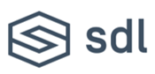
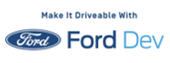

# About SDL & FORDDEV

**About SDL**

[SDL](https://smartdevicelink.com/) is the industry standard for open source in-vehicle connectivity. For automakers and suppliers, SDL adoption broadens the choices for customers in how they connect and control their smartphones while on the move. SDL is the open source software on which the Ford AppLink platform is built. Industry adoption of SDL provides significant benefits to developers interested in connecting their apps for safer in-vehicle use.

**About Ford Developer Program**

The [Ford Developer Program](http://ford.to/2uKi7OT) opened its doors at CES in 2013, commemorating the 150th anniversary of Henry Ford’s birth, celebrating his innovative spirit and his belief that to create something truly great, he needed to surround himself with other likeminded individuals. By creating the automotive industry’s first end-to-end developer ecosystem, Ford invited developers from all across the globe to innovate and see their content enjoyed in the vehicle in a way never seen before and over 30,000 developers have done so. At this monumental event, Ford contributed the AppLink core to the open source community…and SDL was born!

